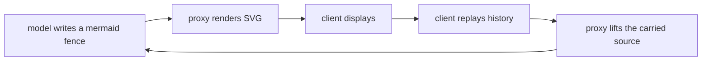

# flowchart

The model draws a diagram as mermaid; the client shows a polished SVG instead.



## How it works

1. The plugin's `instructions` tell the model it can answer with a mermaid fenced block.
2. On the way out, the proxy buffers that fence and `mermaid.js` + `layout.js` + `svg.js` turn it
   into a standalone SVG, delivered as an ` ```svg ` fenced block. The same source goes to the
   thinking channel as a carried `<plugin-fence>` block (the `carried` rail in `src/sdk.js`), so the
   client stores it.
3. On the way back in, the proxy lifts that block out as context. The model keeps an accurate,
   cheap memory of the diagram, and nothing is embedded in the SVG for the plugin to parse.

The SVG rides an ` ```svg ` fence rather than a `` image because
many clients reject a `data:` source in a markdown image and show an empty box. A fence draws the
diagram where the client renders svg, and degrades to readable code (not a blank image) where it
does not.

That round trip works for both `/v1/chat/completions` and `/v1/responses`, streaming or not.

## What it can draw

- `flowchart TD` / `graph LR` (also `TB`, `BT`, `RL`).
- Shapes: `id[rect]`, `id(round)`, `id([stadium])`, `id[[subroutine]]`, `id[(cylinder)]`,
  `id((circle))`, `id{decision}`, `id{{hexagon}}`, `id[/data/]`, `id[\data\]`, `id>asymmetric]`.
- Edges: `-->`, `---`, `-.->`, `-.-`, `==>`, `===`, with labels as `A -->|label| B` or
  `A -- label --> B`, and chains like `A --> B --> C` or `A --> B & C`.
- `subgraph name ... end`, `classDef`, `class`, and `style`.
- Quoted labels, `<br/>` line breaks, `%%` comments.

Anything it cannot read is left as the original fence, so a diagram it does not understand still
shows up as code rather than as a broken picture.

## Visual style

The default uses a soft dotted canvas, white rounded nodes, pastel group colours, subtle
shadows and open arrowheads. Labels wrap automatically (including Chinese text), and edge
captions sit above connectors on small white cards. SVGs scale down to their container while
keeping their intrinsic size for export.

See [the rendered example](examples/preview.svg) and its [Mermaid source](examples/preview.mmd).

`maxTextWidth` controls wrapping; `layerGap`, `nodeGap` and `padding` control spacing.
The renderer increases spacing when labels or group headers need more room. Explicit Mermaid
node styles still override the default colours.

## The template

`theme.js` is the template: colours, fonts, spacing and the shadow. To restyle without editing code,
drop a `theme.json` next to this file:

```json
{
  "fontSize": 15,
  "node": { "fill": "#f3f0ff", "stroke": "#7c5cff", "text": "#241a4d" },
  "palette": [
    { "fill": "#f3f0ff", "stroke": "#7c5cff" },
    { "fill": "#e8fbf3", "stroke": "#12a06a" }
  ]
}
```

It is read once at start, like everything a plugin contributes to the prompt, so restart the proxy
after changing it. Toggle the plugin off and on from the admin page (`/admin/plugins`); like every
module it is switchable per conversation with `<disable_module>flowchart</disable_module>` in the
first user message.
